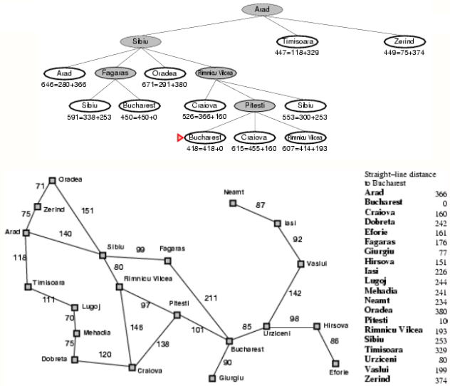

# Camino hacia Bucarest
## Abstract
El camino hacia el problema de la inteligencia artificial de Bucarest es largo y requiere conocimientos de algoritmos de búsqueda y estructuras de datos. Utilizando las estructuras de datos adecuadas podremos encontrar la ruta más corta desde cualquier ciudad hasta el destino final que es Bucarest. La clave del éxito reside en comprender el problema y encontrar las soluciones creativas que mejor se adapten a él. Con este enfoque, seremos capaces de encontrar una ruta corta a cualquiera de las ciudades dadas.

El objetivo de este proyecto es escribir un programa que implemente el Algoritmo de Búsqueda A* para encontrar la ruta de solución desde un nodo inicial hasta un nodo meta.

El algoritmo A* es un algoritmo de búsqueda de caminos que se utiliza a menudo en los videojuegos y otras aplicaciones para encontrar el camino más corto o más eficiente de un punto a otro. Se considera uno de los mejores algoritmos para encontrar caminos, ya que puede tener en cuenta diferentes factores como el terreno, los obstáculos e incluso la inteligencia artificial del enemigo.

## Introducción

Existen varios algoritmos de búsqueda que pueden utilizarse para resolver problemas de búsqueda de rutas. Algunos de los más populares son la búsqueda en profundidad, la búsqueda en profundidad y A*.

La búsqueda de amplitud se utiliza a menudo para la búsqueda de rutas porque garantiza la búsqueda del camino más corto desde el punto de partida hasta la meta. Sin embargo, puede ser lenta en algunos casos.

La búsqueda en profundidad es normalmente más rápida que la búsqueda en profundidad, pero no siempre encuentra el camino más corto.  En algunos casos, la búsqueda en profundidad queda atrapada en un bucle infinito si no hay bucles en el mapa o si hay varios objetivos.  Si se sabe que no hay bucles, este algoritmo puede ser muy eficaz para encontrar caminos de forma rápida y eficiente, pero si no se sabe con seguridad si hay o no bucles, puede no ser ideal, ya que, como se ha dicho, puede quedar atrapado en un bucle infinito con bastante facilidad en esas circunstancias.

 A* se considera a menudo el mejor algoritmo de búsqueda porque combina las características de "breadth first" y "depth first", añadiendo además su propia heurística, de modo que sabe de antemano lo "bueno" que puede ser un camino determinado, lo que le permite dejar de lado los caminos malos y explorar sólo los buenos, ahorrando un tiempo considerable.

 Aqui tenemos una imagen del mapa de Rumania con las ciudades y las distancias entre ellas.

 

## Objetivos
Hay muchos objetivos a la hora de resolver un algoritmo de búsqueda. Los objetivos más comunes son encontrar el camino más corto desde un punto de partida hasta una meta, o encontrar el mejor camino desde un punto de partida hasta una meta. Otros objetivos pueden ser encontrar todos los caminos posibles desde un punto de partida, o encontrar caminos que eviten ciertos obstáculos.

## Herramientas utilizadas
Para este proyecto se utilizaron las siguientes herramientas:

[VSCode](https://code.visualstudio.com/)

[Git](https://git-scm.com/)

[GitHub](www.github.com)

[Neovim](https://neovim.io/)

[Markdown All in One](https://marketplace.visualstudio.com/items?itemName=yzhang.markdown-all-in-one)

## Lenguajes utilizados

[C++](https://www.cplusplus.com/)

[LaTeX](https://www.latex-project.org/)

[Markdown](https://www.markdownguide.org/)

[Shell](https://en.wikipedia.org/wiki/Shell_script)

## Referencias

[CLRS](https://www.amazon.com/Introduction-Algorithms-3rd-MIT-Press/dp/0262033844)

[Inteligencia Artificial](https://www.amazon.com/Artificial-Intelligence-3rd-Stuart-Russell/dp/0136042597)

[Mastering Data Structures & Algorithms using C and C++](https://www.udemy.com/course/datastructurescncpp/)

## Uso y explicacion
**Compilación**

Para utilizar nuestro programa necesitamos manualmente elegir desde cual ciudad vamos abordar nuestra busqueda, la ciudad de destino en este caso siempre sera Bucharest, y el programa nos mostrara la ruta mas corta para llegar a dicha ciudad.

Para poder cambiar la ciudad lo hacemos en la linea 237 del archivo main.cpp, aqui una imagen:

Manualmente podemos cambiar la ciudad de origen, en esta imagen mostramos como seria el programa si buscamos la ruta mas corta desde Neamt a Bucharest, aqui podemos cambiar la ciudad de origen a cualquier otra de las 20 ciudades que se encuentran en el mapa.

**Salida**

El programa nos mostrara la ruta mas corta para llegar a Bucharest desde la ciudad que hayamos elegido, en este caso Neamt, y nos mostrara el costo de dicha ruta.

Aqui lo que podemos esperar de la salida de nuestro programa:
1. Una alerta de que se ha encontrado exitosamente la ruta mas corta.
2. Muestra de la solucion, en este caso se imprimen las ciudades que se deben recorrer para llegar a Bucharest.
3. Numero de pasos para llegar a la solucion.

**Acceso**

Hoy en dia es mas facil que nunca compartir nuestro codigo, ya que existen plataformas como GitHub, donde podemos subir nuestro codigo y compartirlo con el mundo, en este caso GitHub ciertamente es que permite a otras personas ver nuestro codigo y descargarlo, pero el unico problema es que se necesitan programas como Git y un compilador de C++ para poder ejecutar el programa, pero no es necesario recurrir a soluciones como estas ya que existen compañias como [Repl.it](https://repl.it/) que nos permiten ejecutar nuestro codigo sin necesidad de instalar nada, en este caso podemos ver nuestro codigo y ejecutarlo en el mismo sitio.

Escanear el codigo QR para acceder al programa

## Definicion del Algoritmo de Busqueda A*
La forma más conocida de búsqueda del mejor primero es la llamada Búsqueda A*. 
Evalúa los nodos mediante combinando g(n), el coste de llegar al nodo, y h(n), el coste de llegar del nodo al objetivo:

$$F(n) = g(n) + h(n)$$

Dado que g(n) da el coste del camino desde el nodo inicial hasta el nodo n, y h(n) es el coste estimado del
más barato de n a la meta, tenemos:
F(n)= coste estimado de la solución más barata a través de n.

Por lo tanto, si estamos tratando de encontrar la solución más barata, algo razonable es probar primero el nodo con
el más bajo de f(n).

Resulta que esta estrategia es más razonable: siempre que la función heurística h(n) satisfaga ciertas condiciones, la búsqueda A* es completa y óptima. El algoritmo es idéntico al de la búsqueda de coste uniforme, salvo que A* utiliza g(h) y h(n) en lugar de g(h).

El funcionamiento de la búsqueda A* se ilustra de la siguiente manera. Cada vez, el nodo que tiene el valor
valor más bajo de f(n) es el nodo expandido.
Los nodos objetivo se expandirán hasta llegar al destino objetivo, que es Bucarest.

## Conclusion
Hay muchos algoritmos de búsqueda diferentes a disposición de los desarrolladores, y el algoritmo más apropiado para una tarea determinada puede variar en función de la naturaleza de los datos que se buscan. Al elegir un algoritmo de búsqueda, es importante tener en cuenta tanto la complejidad temporal como la espacial del algoritmo. La complejidad temporal es una medida del tiempo que tarda el algoritmo en encontrar una solución, mientras que la complejidad espacial es una medida de la cantidad de memoria que necesita el algoritmo.

Los algoritmos de búsqueda más sencillos son los métodos de fuerza bruta, que se limitan a probar todas las soluciones posibles hasta encontrar una que funcione. Estos métodos pueden ser muy lentos, pero no requieren más memoria que la necesaria para almacenar los datos buscados. Los algoritmos más sofisticados utilizan heurísticas, o reglas empíricas, para eliminar algunas posibilidades antes de considerarlas todas. Los algoritmos de búsqueda heurística pueden ser mucho más rápidos que los métodos de fuerza bruta, pero pueden requerir más memoria si su heurística es compleja.

**No hay un único algoritmo de búsqueda que sea el mejor; en su lugar, se debe elegir un algoritmo adecuado basándose tanto en su complejidad de tiempo y espacio como en su capacidad para encontrar soluciones utilizando la heurística.**

## Licencia
[MIT](LICENSE)

## Autor
[Felipe Vallejo](https://www.linkedin.com/in/felipe-vallejo-200188/)
